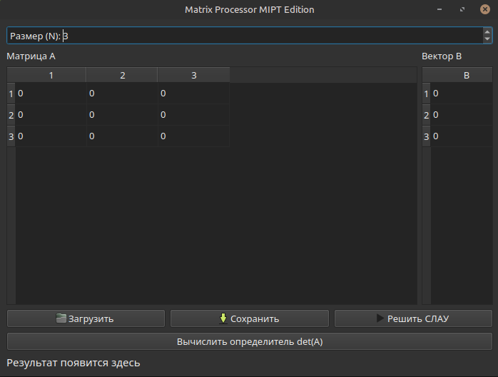

# Matrix

Matrix — учебный C++ проект для работы с матрицами. Программа позволяет вычислять определитель квадратной матрицы, решать системы линейных алгебраических уравнений и работать как через консоль, так и через графический интерфейс на Qt.




## Возможности проекта

- вычисление определителя квадратной матрицы;
- решение СЛАУ вида `A * x = b`;
- графический интерфейс на Qt6;
- консольная версия программы;
- импорт матриц из `.txt` и `.csv` файлов;
- экспорт матрицы в `.txt` или `.csv`;
- автоматическое определение типа данных при вычислении определителя в GUI;
- обработка ошибок ввода;
- набор unit-тестов на GoogleTest.

## Используемые технологии

- C++23;
- CMake;
- Qt6 Widgets;
- GoogleTest;
- pthread.

## Структура проекта

```text
final_project/
├── CMakeLists.txt
├── main.cpp
├── include/
│   ├── matrix.hpp
│   └── type_detector.h
├── src/
│   ├── main_gui.cpp
│   ├── mainwindow.cpp
│   ├── mainwindow.h
│   └── mainwindow.ui
└── tests/
    └── test_main.cpp
```

## Установка зависимостей

### Linux / Ubuntu

```bash
sudo apt update
sudo apt install build-essential cmake ninja-build qt6-base-dev qt6-tools-dev libgtest-dev
```

## Сборка проекта

Из корневой папки проекта:

```bash
cmake -S . -B build
cmake --build build
```

Если используется Ninja:

```bash
cmake -S . -B build -G Ninja
cmake --build build
```

## Запуск консольной версии

```bash
./build/a.out
```

Формат ввода:

```text
n
a11 a12 ... a1n
a21 a22 ... a2n
...
an1 an2 ... ann
```

Пример:

```text
3
2 1 -1
-3 -1 2
-2 1 2
```

Программа выведет определитель матрицы.

## Запуск графической версии

```bash
./build/matrix_gui
```

В графическом интерфейсе можно:

- задать размер матрицы;
- заполнить матрицу вручную;
- вычислить определитель;
- решить СЛАУ;
- импортировать матрицу из файла;
- экспортировать матрицу в файл.

## Формат файлов для импорта

Программа поддерживает два формата.

### Квадратная матрица для определителя

```text
1 2 3
4 5 6
7 8 9
```

### Расширенная матрица для СЛАУ

Последний столбец считается вектором `B`.

```text
2 1 -1 8
-3 -1 2 -11
-2 1 2 -3
```

Также можно использовать CSV-формат:

```csv
2,1,-1,8
-3,-1,2,-11
-2,1,2,-3
```

## Запуск тестов

После сборки:

```bash
ctest --test-dir build
```

Или напрямую:

```bash
./build/tests
```

Тесты проверяют вычисление определителя для разных типов матриц: нулевых, единичных, диагональных, треугольных, симметричных, матриц с дробными значениями и матриц разных размеров.

## Обработка ошибок

В проекте предусмотрена обработка следующих ситуаций:

- неверный размер матрицы;
- некорректный ввод элементов;
- попытка вычислить определитель неквадратной матрицы;
- пустая матрица;
- несовпадение размера матрицы и вектора `B`;
- вырожденная матрица при решении СЛАУ;
- ошибка открытия или создания файла;
- неверный формат импортируемого файла.

## Пример использования

1. Запустить `matrix`.
2. Выбрать размер матрицы.
3. Заполнить значения матрицы.
4. Для вычисления определителя нажать кнопку расчёта определителя.
5. Для решения СЛАУ заполнить матрицу `A` и столбец `B`, затем нажать кнопку решения.
6. При необходимости импортировать данные из `.txt` или `.csv` файла.

## Особенности реализации

Основная логика работы с матрицами вынесена в шаблонный класс `Matrix`. Класс поддерживает разные числовые типы данных и реализует:

- хранение матрицы в динамической памяти;
- безопасный доступ к элементам через метод `at`;
- вычисление определителя методом Гаусса с выбором ведущего элемента;
- решение СЛАУ методом Гаусса;
- обработку исключительных ситуаций.

